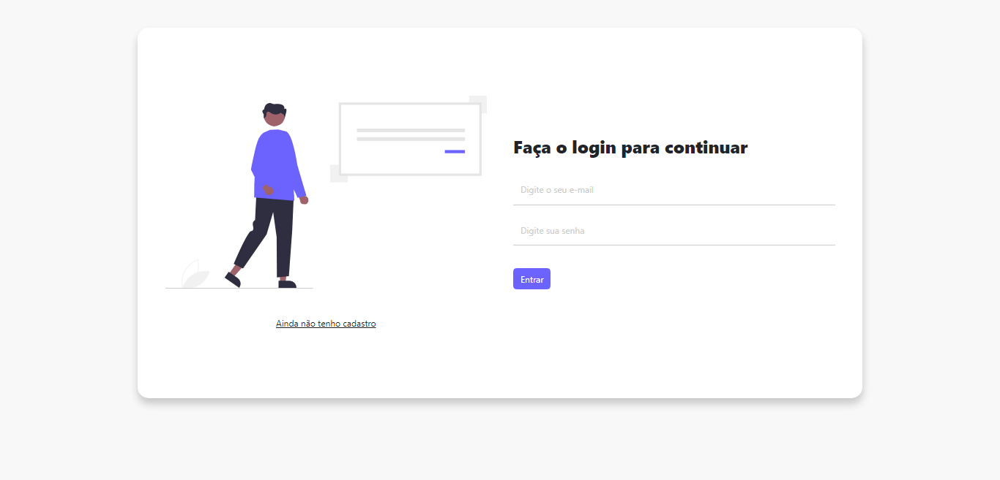
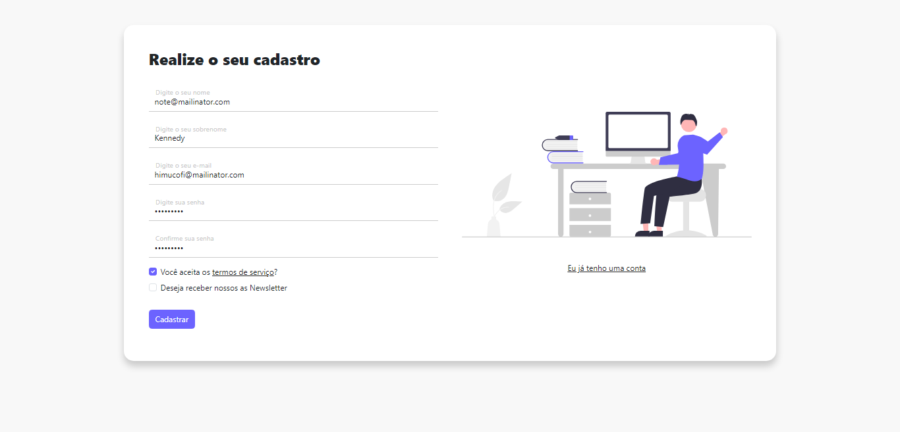
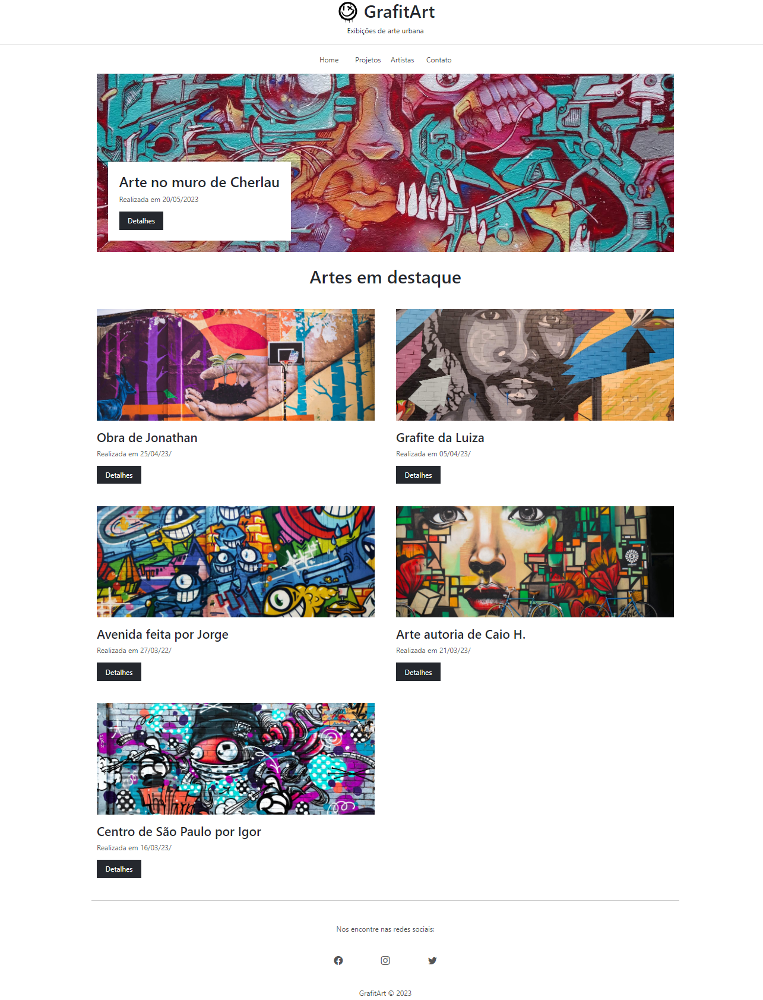
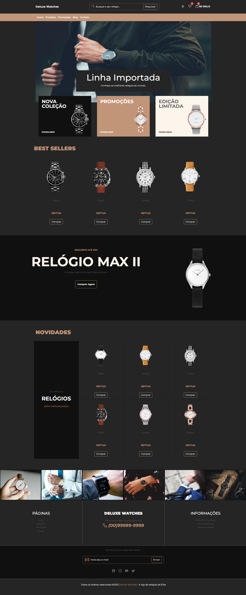

<h1 align="center" style="font-weight: bold;">Tela de login/cadastro, Galeria e Ecommerce com Bootstrap</h1>

    

  

 <a href="#-sobre">Sobre</a> •
 <a href="#-projetos">Projetos</a> •
 <a href="#%EF%B8%8F-autor">Autor</a>

## 💻 Sobre

Implementação de tela de cadastro/login, página de uma galeria e página de ecommerce utilizando o framework Bootstrap realizado no curso <a href="https://www.udemy.com/course/bootstrap-5-do-basico-ao-avancado-com-4-projetos/" target="_blank">Bootstrap 5 do básico ao avançado</a>. As telas foram desenvolvidas de forma responsiva e intuitiva, proporcionando uma experiência agradável aos usuários.

<h3 align="center"> 
⚙️ Tecnologias utilizadas

&nbsp;

</h3>

---

## 🚧 Projetos

<h3 align="center">Página de Login
    

    
</h3>

<h3 align="center">Página de Cadastro
    

  	
</h3>

---

<h3 align="center">Página de galeria
    

    
</h3>

---

<h3 align="center">Página de ecommerce
    

    
</h3>

---

<h3 align="center">📜 Certificado
    

    
</h3>

---

## ✒️ Autor

| [    Cherlau Prado ](https://github.com/cherPrado) |
| :--------------------------------------------------------------------------------------------------------------------------------------------: |

<h2 >Entre em contato 🤙🏽</h2>

